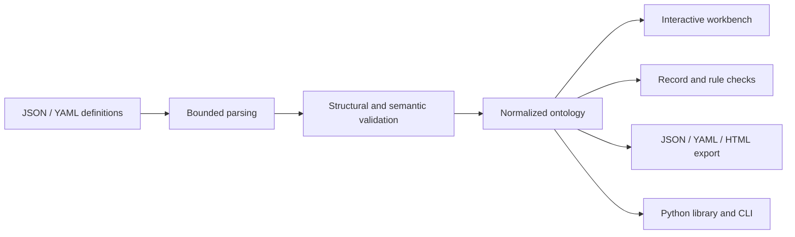

<div align="center">

# Enterprise AI Ontology

**A shared business language for enterprise AI and the teams building it.**

Lightweight ontology DSL · Python CLI · Local visual workbench

[](https://github.com/fdeopen/enterprise-ai-ontology/actions/workflows/ci.yml)
[](pyproject.toml)
[](LICENSE)
[](https://fdechina.ai/)

[简体中文](README.md) | **English**

[Quick start](#quick-start) · [DSL example](#dsl-example) · [Industry templates](#industry-examples) · [Documentation](#documentation) · [Contributing](#contributing)

**Author: 越哥聊AI** · **WeChat Official Account: FDE前线** · **Website: [FDEChina.ai](https://fdechina.ai/)**

</div>

---

Enterprise AI Ontology describes **Entities, Properties, Relationships, Actions, Rules, and Events** in version-controlled, validated JSON or YAML files. It gives Forward Deployed Engineers (FDEs), business architects, and AI developers a shared contract: which business objects exist, how they relate, which actions are available, what constraints apply, and which facts an AI use case depends on.

**No database, LLM, or API key required.** The only direct runtime dependencies are Pydantic and PyYAML. The frontend uses plain HTML, CSS, and JavaScript, with no build step, remote fonts, or CDN. The current package version is **0.1.0**, with **DSL 1.0**, intended for business modeling, delivery alignment, and prototyping.

<a id="why"></a>
## Why this project

Business definitions in enterprise AI projects are often scattered across requirements, prompts, database fields, and API documentation. For a task such as approving a return, a team needs to agree on the associated order, the responsible approver, the preconditions, and the event produced by the decision.

This toolkit brings those definitions into one reviewable model. AI scenarios connect their inputs, outputs, evaluation metrics, and human responsibilities to concrete business objects. Teams can establish the business meaning before implementing prompts, agent tools, or RAG pipelines.

<a id="features"></a>
## Features

| Capability | Available today |
| --- | --- |
| Six business concepts | Entities, properties, relationships, actions, rules, and events, plus traceable AI scenarios |
| Two validation layers | JSON Schema structure checks plus semantic checks for IDs, primary keys, references, enums, and rule types |
| Declarative rules | `all` / `any` conditions, 11 operators, single-record validation, and per-rule results |
| Interactive visualization | Entity and business graphs, search, zoom, pan, object details, and scenario focus |
| JSON and YAML | Import, edit, validate, normalize, convert, and export definitions |
| Offline sharing | Self-contained HTML snapshots with graphs, definitions, scenarios, and JSON / YAML export |
| Five industry templates | E-commerce, foreign trade, manufacturing, medical aesthetics, and recruitment, with positive and negative records |
| Developer interfaces | Python library, CLI, loopback HTTP API, and exportable JSON Schema |

<a id="quick-start"></a>
## Quick start

Requires **Python 3.11+** and [uv](https://docs.astral.sh/uv/getting-started/installation/). Run these commands from the repository root.

```bash
# 1. Clone and install; development tools are included by default
git clone https://github.com/fdeopen/enterprise-ai-ontology.git
cd enterprise-ai-ontology
uv sync --locked

# 2. Create an editable e-commerce model
uv run enterprise-ontology init ecommerce --output output/my-commerce

# 3. Validate the definition and check a sample order
uv run enterprise-ontology validate output/my-commerce/ontology.yaml
uv run enterprise-ontology check output/my-commerce/ontology.yaml \
  --entity Order --record output/my-commerce/record.valid.json

# 4. Export a standalone HTML snapshot
uv run enterprise-ontology render output/my-commerce/ontology.yaml \
  --output output/commerce.html

# 5. Start the local workbench
uv run enterprise-ontology serve --port 8878
```

Open [http://127.0.0.1:8878](http://127.0.0.1:8878). Choose an industry or import `output/my-commerce/ontology.yaml`, inspect objects, edit and validate definitions, try rules, and export your work.

The `init` command generates:

```text
output/my-commerce/
├── ontology.yaml         # YAML definition
├── ontology.json         # Equivalent JSON representation
├── record.valid.json     # A record expected to pass
├── record.invalid.json   # A record expected to fail
└── README.md             # Instructions for this industry
```

The workbench opens the built-in e-commerce example; **it does not automatically read a directory created by the CLI**. Changes live in the current browser page, so export before refreshing. Exports contain the last validated model, not unapplied editor drafts. Offline HTML supports browsing and definition export; editing with validation and record checks require the local workbench or CLI.

<details>
<summary>Install with pip instead of uv</summary>

After cloning the repository and entering its directory:

```bash
python -m venv .venv
source .venv/bin/activate
# Windows PowerShell: .venv\Scripts\Activate.ps1
python -m pip install .
enterprise-ontology serve --port 8878
```

Use `python3` if that is your system's Python command. This installs from source and does not assume that a package with this name has been published to PyPI.

</details>

<a id="dsl-example"></a>
## Define a business contract in YAML

This model declares an order with a status, a paid-before-shipping rule, an action requiring human approval, and a resulting shipment event. Save it as `order.yaml` and run `uv run enterprise-ontology validate order.yaml`.

```yaml
schema_version: '1.0'
id: Commerce
name: Order shipping model
version: 0.1.0
industry: E-commerce
description: A minimal business contract for approving order shipment.

entities:
  - id: Order
    label: Order
    description: An order with a stable identifier.
    primary_key: id
    properties:
      - id: id
        label: Order ID
        description: Unique order identifier.
        type: string
        required: true
      - id: status
        label: Status
        description: Simplified order status.
        type: enum
        required: true
        enum_values: [pending, paid, shipped]

rules:
  - id: PaidBeforeShipping
    label: Check payment before shipping
    description: A precondition used during shipment approval.
    entity: Order
    conditions:
      - property: status
        operator: eq
        value: paid
    message: Confirm that the order is paid before shipping.

actions:
  - id: ShipOrder
    label: Approve shipment
    description: Warehouse staff review and arrange shipment.
    entity: Order
    requires_rules: [PaidBeforeShipping]
    emits: [OrderShipped]
    human_approval: true

events:
  - id: OrderShipped
    label: Order shipped
    description: A business event declaring that an order has shipped.
    entity: Order
```

Property types include `string`, `integer`, `number`, `boolean`, `date`, `datetime`, `enum`, `string_list`, and `json`. Relationships support one-to-one, one-to-many, many-to-one, and many-to-many cardinality. The industry templates also define relationships and AI scenarios. See the [DSL reference (Chinese)](docs/dsl.md) and [JSON Schema](schema/ontology.schema.json).

> **Rules have a business context.** `check` evaluates every rule attached to the selected entity, including action preconditions. A `pending` order failing the payment check is not ready to ship; this does not make `pending` an invalid lifecycle state. Actions and events are declarations. Your application implements authorization, approval, execution, and event publication.

<a id="architecture"></a>
## How it works



JSON Schema checks field structure; Python validators check references and business constraints. The parser rejects duplicate keys, YAML aliases, non-JSON values, and dynamic object construction, with limits on input size and nesting. Rules do not execute arbitrary code. See [Architecture and extension points (Chinese)](docs/architecture.md).

<a id="industry-examples"></a>
## Five industries, ten AI scenarios

Each template includes **6 entities, 3 actions, 4 rules, 3 events, and 2 AI scenarios**, equivalent JSON and YAML definitions, and positive and negative sample records.

| Industry / CLI ID | Core business objects | AI scenarios | Model |
| --- | --- | --- | --- |
| E-commerce · `ecommerce` | Customers, products, inventory, orders, shipments, returns | Support copilot; fulfillment exception analysis | [YAML](src/enterprise_ai_ontology/examples/ecommerce/ontology.yaml) |
| Foreign trade · `foreign_trade` | Buyers, inquiries, quotations, contracts, shipments, documents | Multilingual inquiry assistant; document consistency checks | [YAML](src/enterprise_ai_ontology/examples/foreign_trade/ontology.yaml) |
| Manufacturing · `manufacturing` | Orders, work orders, machines, material lots, inspections, maintenance | Quality traceability; maintenance assistant | [YAML](src/enterprise_ai_ontology/examples/manufacturing/ontology.yaml) |
| Medical aesthetics · `medical_aesthetics` | Clients, consultations, practitioners, plans, appointments, follow-ups | Consultation summaries; follow-up routing | [YAML](src/enterprise_ai_ontology/examples/medical_aesthetics/ontology.yaml) |
| Recruitment · `recruitment` | Jobs, candidates, applications, interviews, evaluations, offers | Job-related evidence assistant; interview summaries | [YAML](src/enterprise_ai_ontology/examples/recruitment/ontology.yaml) |

All models are fictional educational examples, with no real customer or personnel data. The bundled descriptions and current workbench UI are primarily in Chinese; technical IDs and DSL keys use English. See the [Industry guide (Chinese)](docs/industries.md).

<a id="cli"></a>
## CLI reference

Use `uv run enterprise-ontology <command>` from the repository root, or `enterprise-ontology` directly in an environment where the package is installed.

| Command | Purpose |
| --- | --- |
| `examples` | List built-in industries and model counts |
| `init <industry> --output <dir>` | Initialize a model and sample records in a new directory |
| `validate <file> [--json]` | Validate structure, references, and rule types |
| `convert <file> --output <file.json\|file.yaml>` | Convert between definition formats |
| `schema [--output <file>]` | Export JSON Schema; omit the output path to write to stdout |
| `check <file> --entity <id> --record <record.json>` | Check a record and its entity's rules |
| `render <file> --output <report.html>` | Generate a standalone HTML snapshot |
| `serve [--host 127.0.0.1] [--port 8878]` | Start the local workbench |

File-writing commands refuse to overwrite existing output. Choose a new path when repeating a command. Keep one JSON or YAML file as the source of truth and use `convert` to regenerate the other format. Run `--help` for all options.

Validation exit codes: `0` for success, `1` for definition, parsing, or file errors, and `2` when record fields or error-level rules fail. Failed warning-level rules remain visible without blocking success. Invalid CLI arguments may also cause argparse to return `2`.

<a id="python-api"></a>
## Python API

After initializing the example in the quick start:

```python
from enterprise_ai_ontology import dumps, load
from enterprise_ai_ontology.rules import check_record

ontology = load("output/my-commerce/ontology.yaml")
print(ontology.counts())

result = check_record(ontology, "Order", {
    "id": "ORD-DEMO-001",
    "status": "paid",
    "total": 299.0,
    "currency": "CNY",
})
assert result["valid"]
print(result["rules"])

json_definition = dumps(ontology, "json")
```

Loopback HTTP endpoints and request/response shapes are listed in the [API reference (Chinese)](docs/architecture.md#http-api).

<a id="project-layout"></a>
## Project layout

```text
enterprise-ai-ontology/
├── src/enterprise_ai_ontology/
│   ├── models.py          # DSL models, JSON Schema, semantic constraints
│   ├── serialization.py   # Bounded JSON / YAML I/O
│   ├── rules.py           # Single-record assertions
│   ├── cli.py             # CLI entry point
│   ├── server.py          # Local HTTP workbench
│   ├── render.py          # Standalone HTML export
│   ├── static/            # Frontend with no build step
│   └── examples/          # Five industry models and sample records
├── schema/                # Generated JSON Schema
├── tests/                 # DSL, rules, CLI, and HTTP tests
├── docs/                  # DSL, industry, and architecture references
└── .github/               # CI and contribution templates
```

<a id="scope"></a>
## Scope and limitations

- **Modeling and validation:** no graph database, OWL reasoning, cross-entity queries, or workflow execution. Relationship cardinality is a declaration, not a database-instance check.
- **AI scenario contracts:** describe inputs, outputs, evaluation goals, and human responsibilities. They do not call models or automate clinical, hiring, or other consequential decisions.
- **Local workbench:** loopback binding only, with no login, multi-user isolation, or server-side persistence. A production service needs these capabilities separately.
- **Sharing:** exported HTML contains the complete model. The `sensitive` flag is metadata and does not implement redaction or access control.
- **Compatibility:** 0.1.x is an early version. DSL structure changes require explicit versioning and validation. Example rules are not ready-made enterprise policies.

<a id="documentation"></a>
## Documentation

| Document | Contents |
| --- | --- |
| [中文 README](README.md) | Chinese overview and getting-started guide |
| [DSL reference (Chinese)](docs/dsl.md) | Types, references, operators, constraints, and format boundaries |
| [Architecture (Chinese)](docs/architecture.md) | Modules, data flow, HTTP API, and integration |
| [Industry guide (Chinese)](docs/industries.md) | Business chains and source definitions |
| [JSON Schema](schema/ontology.schema.json) | Machine-readable structural definition |
| [Contributing](CONTRIBUTING.md#english) | Development workflow, model contributions, and PR expectations |
| [Security](SECURITY.md#english) | Local execution and model-sharing boundaries |

<a id="contributing"></a>
## Contributing

Contributions are welcome for industry models, edge cases, validation, English documentation, and visualization. Check [existing issues](https://github.com/fdeopen/enterprise-ai-ontology/issues) before filing a report. For substantial DSL changes, start by describing the business need and compatibility implications.

```bash
uv sync --locked --group dev
uv run pytest -q
uv run ruff check src tests
uv run ruff format --check src tests
uv run python -m build
```

Tests cover industry round trips, reference integrity, rule operators, invalid input, the CLI, and local HTTP endpoints. CI runs tests, lint, formatting checks, and builds on Python 3.11 / 3.12 / 3.13. See [CONTRIBUTING.md](CONTRIBUTING.md#english).

Possible future directions include model diffing and migrations, layouts for larger graphs, and runtime checks for action parameters and event payloads. These are discussion topics, not implemented features or delivery commitments.

<a id="community"></a>
## Author and community

| | Details |
| --- | --- |
| **Author** | **越哥聊AI** |
| **WeChat Official Account** | **FDE前线** — search this name in WeChat |
| **Website** | **[FDEChina.ai](https://fdechina.ai/)** |
| **Code and feedback** | [fdeopen/enterprise-ai-ontology](https://github.com/fdeopen/enterprise-ai-ontology) · [Issues](https://github.com/fdeopen/enterprise-ai-ontology/issues) |

Share your enterprise AI modeling and delivery experience through the project. If the toolkit helps your work, consider starring the repository, reporting an issue, or contributing an industry model.

<a id="license"></a>
## License

Released under the [MIT License](LICENSE). Retain its copyright and permission notice when using, modifying, or distributing the software.
