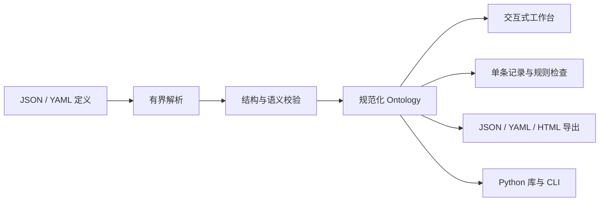

<div align="center">

# Enterprise AI Ontology

**让企业业务成为 AI 可以理解、团队可以协作的语言。**

轻量级企业 Ontology DSL · Python CLI · 本地可视化工作台

[](https://github.com/fdeopen/enterprise-ai-ontology/actions/workflows/ci.yml)
[](pyproject.toml)
[](LICENSE)
[](https://fdechina.ai/)

**简体中文** | [English](README.en.md)

[快速开始](#quick-start) · [DSL 示例](#dsl-example) · [行业模板](#industry-examples) · [文档](#documentation) · [参与贡献](#contributing)

**作者：越哥聊AI** · **公众号：FDE前线** · **网站：[FDEChina.ai](https://fdechina.ai/)**

</div>

---

Enterprise AI Ontology 将企业中的 **Entity、Property、Relationship、Action、Rule、Event** 定义为可版本管理、可校验、可视化的 JSON / YAML 文件。它为 FDE、业务架构师和 AI 应用开发者提供一份共同的业务契约：有哪些对象、如何关联、允许哪些动作、需要满足什么规则，以及 AI 场景依赖哪些业务事实。

**无需数据库、LLM 或 API Key。** 运行时仅依赖 Pydantic 和 PyYAML；前端使用原生 HTML / CSS / JavaScript，无构建步骤、远程字体或 CDN。当前版本为 **0.1.0**，DSL 版本为 **1.0**；适合业务建模、交付对齐和原型验证。

<a id="why"></a>
## 为什么做这个项目

企业 AI 项目的业务定义经常分散在需求文档、Prompt、数据库字段和接口说明中。以“批准售后”为例，团队需要明确：售后申请关联哪个订单，谁有权审批，审批前检查什么，以及审批后产生什么事件。

本项目把这些定义放进同一份可审阅的模型中，并将 AI 场景的输入、输出、评估指标和人工职责关联到具体业务对象。你可以在写 Prompt、设计 Agent 工具或实施 RAG 之前，先把业务语义讲清楚。

<a id="features"></a>
## 核心能力

| 能力 | 已实现的内容 |
| --- | --- |
| 六类业务概念 | 实体、属性、关系、动作、规则、事件，以及可追溯的 AI 场景 |
| 双层校验 | JSON Schema 结构校验 + ID、主键、引用、枚举及规则类型的语义校验 |
| 声明式规则 | `all` / `any` 组合、11 个条件操作符、单条记录校验与逐条结果 |
| 交互式图谱 | 实体关系图、业务全景、搜索、缩放、画布拖动、详情面板和场景聚焦 |
| JSON / YAML | 导入、编辑、校验、规范化转换与导出 |
| 离线分享 | 自包含 HTML 快照，可查看图谱、定义和场景并导出 JSON / YAML |
| 五行业模板 | 电商、外贸、制造、医美、招聘，附正反记录与 AI 应用场景 |
| 开发者接口 | Python 库、CLI、本机 HTTP API 与可导出的 JSON Schema |

<a id="quick-start"></a>
## 快速开始

需要 **Python 3.11+** 和 [uv](https://docs.astral.sh/uv/getting-started/installation/)。以下命令从仓库根目录执行。

```bash
# 1. 获取并安装项目；默认包含开发工具
git clone https://github.com/fdeopen/enterprise-ai-ontology.git
cd enterprise-ai-ontology
uv sync --locked

# 2. 创建一份可编辑的电商业务模型
uv run enterprise-ontology init ecommerce --output output/my-commerce

# 3. 校验定义，并检查一条示例订单
uv run enterprise-ontology validate output/my-commerce/ontology.yaml
uv run enterprise-ontology check output/my-commerce/ontology.yaml \
  --entity Order --record output/my-commerce/record.valid.json

# 4. 导出可以独立分享的 HTML
uv run enterprise-ontology render output/my-commerce/ontology.yaml \
  --output output/commerce.html

# 5. 启动本地工作台
uv run enterprise-ontology serve --port 8878
```

打开 [http://127.0.0.1:8878](http://127.0.0.1:8878)，选择行业示例或导入 `output/my-commerce/ontology.yaml`。可以查看对象详情、编辑定义并校验、试验规则以及导出文件。

`init` 会生成以下文件：

```text
output/my-commerce/
├── ontology.yaml         # YAML 定义
├── ontology.json         # 同一模型的 JSON 表示
├── record.valid.json     # 应通过规则的示例记录
├── record.invalid.json   # 应被规则拒绝的示例记录
└── README.md             # 当前行业的运行说明
```

工作台启动时加载内置电商示例，**不会自动读取 CLI 创建的目录**。编辑仅保留在当前页面；修改后请导出保存。导出包含已通过校验的版本，未应用的编辑器草稿不会写入导出结果。离线 HTML 提供浏览和定义导出，编辑校验与规则试验需使用本地工作台或 CLI。

<details>
<summary>使用 pip 安装（无需 uv）</summary>

先克隆仓库并进入项目目录，再运行：

```bash
python -m venv .venv
source .venv/bin/activate
# Windows PowerShell: .venv\Scripts\Activate.ps1
python -m pip install .
enterprise-ontology serve --port 8878
```

如果系统使用 `python3` 命令，请替换上面的 `python`。此处从源码安装，不依赖同名 PyPI 包已发布。

</details>

<a id="dsl-example"></a>
## 用一份 YAML 定义业务契约

下面的模型声明：订单具有状态；批准发货需要满足“已支付”规则、经过人工审批，并声明产生发货事件。保存为 `order.yaml` 后，可运行 `uv run enterprise-ontology validate order.yaml`。

```yaml
schema_version: '1.0'
id: Commerce
name: 订单发货模型
version: 0.1.0
industry: 电商
description: 订单发货审批的最小业务契约。

entities:
  - id: Order
    label: 订单
    description: 具有独立标识的订单。
    primary_key: id
    properties:
      - id: id
        label: 订单号
        description: 订单唯一标识。
        type: string
        required: true
      - id: status
        label: 状态
        description: 简化订单状态。
        type: enum
        required: true
        enum_values: [pending, paid, shipped]

rules:
  - id: PaidBeforeShipping
    label: 发货前检查支付
    description: 发货审批时使用的前置断言。
    entity: Order
    conditions:
      - property: status
        operator: eq
        value: paid
    message: 发货前应确认订单已支付。

actions:
  - id: ShipOrder
    label: 批准发货
    description: 仓库人员审核并安排发货。
    entity: Order
    requires_rules: [PaidBeforeShipping]
    emits: [OrderShipped]
    human_approval: true

events:
  - id: OrderShipped
    label: 订单已发货
    description: 订单完成发货操作的业务事件。
    entity: Order
```

属性支持 `string`、`integer`、`number`、`boolean`、`date`、`datetime`、`enum`、`string_list` 和 `json`。关系支持一对一、一对多、多对一和多对多；完整行业模型还包含业务关系和 AI 场景。详见 [DSL 规范](docs/dsl.md) 与 [JSON Schema](schema/ontology.schema.json)。

> **规则的上下文很重要。** `check` 会检查所选实体的全部规则，包括动作前置断言。`pending` 订单无法通过“已支付”检查，意味着它尚不满足发货条件，不代表 `pending` 本身是非法状态。Action 和 Event 是声明，由接入的业务系统落实授权、审批、执行与事件发布。

<a id="architecture"></a>
## 工作原理



JSON Schema 检查字段结构，Python 校验器检查跨对象引用及业务约束。解析器拒绝重复键、YAML alias、非 JSON 值和动态对象构造，并限制输入大小与嵌套深度。规则不执行任意代码。详见 [架构与扩展](docs/architecture.md)。

<a id="industry-examples"></a>
## 五个行业，十个 AI 场景

每个行业提供 **6 个实体、3 个动作、4 个规则、3 个事件、2 个 AI 场景**，并附同义 JSON / YAML 定义及正反记录。

| 行业 / CLI ID | 核心业务对象 | AI 场景 | 模型 |
| --- | --- | --- | --- |
| 电商 · `ecommerce` | 客户、商品、库存、订单、包裹、售后 | 售后客服助手、履约异常分析 | [YAML](src/enterprise_ai_ontology/examples/ecommerce/ontology.yaml) |
| 外贸 · `foreign_trade` | 海外客户、询盘、报价、合同、出运、单据 | 多语言询盘助手、单证一致性助手 | [YAML](src/enterprise_ai_ontology/examples/foreign_trade/ontology.yaml) |
| 制造 · `manufacturing` | 订单、工单、设备、物料批次、检验、维护 | 质量异常追溯、设备维护助手 | [YAML](src/enterprise_ai_ontology/examples/manufacturing/ontology.yaml) |
| 医美 · `medical_aesthetics` | 客户、咨询、专业人员、计划、预约、随访 | 咨询资料整理、随访任务分流 | [YAML](src/enterprise_ai_ontology/examples/medical_aesthetics/ontology.yaml) |
| 招聘 · `recruitment` | 岗位、候选人、申请、面试、评估、录用方案 | 岗位能力证据助手、面试纪要助手 | [YAML](src/enterprise_ai_ontology/examples/recruitment/ontology.yaml) |

所有行业模型均为虚构教学示例，不包含真实客户或人员数据。示例文字和当前工作台界面以中文为主；技术 ID 与 DSL 字段使用英文。参见 [行业说明](docs/industries.md)。

<a id="cli"></a>
## CLI 参考

从项目根目录运行 `uv run enterprise-ontology <command>`；在已安装该包的环境中可直接使用 `enterprise-ontology`。

| 命令 | 用途 |
| --- | --- |
| `examples` | 列出内置行业与模型统计 |
| `init <industry> --output <dir>` | 在新目录中初始化行业模型与样例记录 |
| `validate <file> [--json]` | 校验结构、引用和规则类型 |
| `convert <file> --output <file.json\|file.yaml>` | 转换定义格式 |
| `schema [--output <file>]` | 导出 JSON Schema；省略输出路径时写入 stdout |
| `check <file> --entity <id> --record <record.json>` | 校验单条记录及该实体的规则 |
| `render <file> --output <report.html>` | 生成独立 HTML 快照 |
| `serve [--host 127.0.0.1] [--port 8878]` | 启动本地工作台 |

文件写入命令拒绝覆盖已有输出；重复运行时请选择新的文件名或目录。JSON/YAML 修改时选择一份主文件，再用 `convert` 生成另一份。使用 `--help` 查看全部参数。

校验退出码：`0` 表示通过，`1` 表示定义、解析或文件错误，`2` 表示记录字段或 error 级规则未通过。warning 级规则失败保留结果但不阻断；命令行参数错误也可能由 argparse 返回 `2`。

<a id="python-api"></a>
## Python API

完成快速开始的初始化步骤后：

```python
from enterprise_ai_ontology import dumps, load
from enterprise_ai_ontology.rules import check_record

ontology = load("output/my-commerce/ontology.yaml")
print(ontology.counts())

result = check_record(ontology, "Order", {
    "id": "ORD-DEMO-001",
    "status": "paid",
    "total": 299.0,
    "currency": "CNY",
})
assert result["valid"]
print(result["rules"])

json_definition = dumps(ontology, "json")
```

本机 HTTP API 的路径、请求与响应见 [API 文档](docs/architecture.md#http-api)。

<a id="project-layout"></a>
## 项目结构

```text
enterprise-ai-ontology/
├── src/enterprise_ai_ontology/
│   ├── models.py          # DSL 模型、JSON Schema 与语义约束
│   ├── serialization.py   # 有界 JSON / YAML 读写
│   ├── rules.py           # 单记录断言检查
│   ├── cli.py             # 命令行入口
│   ├── server.py          # 本地 HTTP 工作台
│   ├── render.py          # 独立 HTML 导出
│   ├── static/            # 无构建步骤的前端
│   └── examples/          # 五行业定义与正反记录
├── schema/                # 生成的 JSON Schema
├── tests/                 # DSL、规则、CLI 与 HTTP 测试
├── docs/                  # DSL、行业与架构文档
└── .github/               # CI 与贡献模板
```

<a id="scope"></a>
## 使用边界

- **业务建模与校验**：不包含知识图谱数据库、OWL 推理、跨实体查询或工作流执行。关系基数是模型声明，不验证数据库中的关系实例。
- **AI 场景契约**：记录输入、输出、评估目标和人工职责，不调用模型或自动实施临床、招聘等决策。
- **本地工作台**：仅监听回环地址，无登录、多人隔离或服务端持久化；生产服务需要另行实现这些能力。
- **模型分享**：HTML 会携带完整定义。`sensitive` 是元数据标记，不自动脱敏或实施访问控制。
- **兼容性**：0.1.x 仍在早期演进；DSL 结构变化需明确版本并通过模型校验。请勿将示例规则直接当作真实企业制度。

<a id="documentation"></a>
## 文档

| 文档 | 内容 |
| --- | --- |
| [English README](README.en.md) | 英文项目介绍与完整上手流程 |
| [DSL 设计与语义](docs/dsl.md) | 类型、引用、规则操作符、约束和格式边界 |
| [架构与扩展](docs/architecture.md) | 模块、数据流、HTTP API 与接入方式 |
| [行业示例说明](docs/industries.md) | 五行业业务链及源文件索引 |
| [JSON Schema](schema/ontology.schema.json) | 编辑器可使用的结构定义 |
| [贡献指南](CONTRIBUTING.md) | 开发流程、模型贡献与 PR 要求 |
| [安全说明](SECURITY.md) | 本地运行和业务定义分享的边界 |

<a id="contributing"></a>
## 参与贡献

欢迎贡献行业模型、边界案例、校验改进、英文文档和可视化体验。报告问题前请查看 [已有 Issues](https://github.com/fdeopen/enterprise-ai-ontology/issues)；较大的 DSL 变更请先说明业务场景及兼容性影响。

```bash
uv sync --locked --group dev
uv run pytest -q
uv run ruff check src tests
uv run ruff format --check src tests
uv run python -m build
```

测试覆盖五行业往返转换、引用完整性、规则操作符、错误输入、CLI 和本地 HTTP 接口。CI 在 Python 3.11 / 3.12 / 3.13 上执行测试、静态检查与构建。贡献要求见 [CONTRIBUTING.md](CONTRIBUTING.md)。

后续可讨论的方向包括模型差异与版本迁移、更大的业务图布局、动作参数与事件载荷的运行时校验。这些是候选方向，不是当前已实现功能或交付承诺。

<a id="community"></a>
## 作者与社区

| | 信息 |
| --- | --- |
| **作者** | **越哥聊AI** |
| **微信公众号** | **FDE前线**（在微信中搜索公众号名称） |
| **网站** | **[FDEChina.ai](https://fdechina.ai/)** |
| **代码与反馈** | [fdeopen/enterprise-ai-ontology](https://github.com/fdeopen/enterprise-ai-ontology) · [Issues](https://github.com/fdeopen/enterprise-ai-ontology/issues) |

欢迎在项目中交流企业 AI 的业务建模与落地经验。如果这个工具对你有帮助，可以通过 Star、问题反馈或贡献行业模型支持它。

<a id="license"></a>
## 许可证

本项目采用 [MIT License](LICENSE)。使用、修改与分发时请保留许可证中的版权与许可声明。
