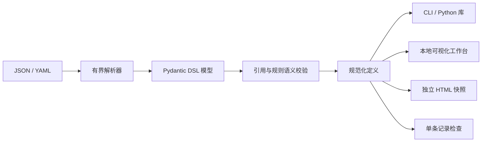

# 架构与扩展

- `models.py`：六类业务概念、AI 场景、引用约束与 JSON Schema。
- `serialization.py`：JSON 兼容 YAML 子集、重复 key / 大小 / 深度检查、互转与防覆盖写入。
- `rules.py`：单记录类型与规则断言检查，纯函数，无 eval / exec。
- `catalog.py` + `examples/`：随 wheel 分发的五个行业模型与正反记录。
- `render.py` + `static/`：同一套 SVG / HTML / CSS / JavaScript 用于 Web 和离线导出。
- `server.py`：标准库 HTTP 服务，不需要 Web 框架。
- `cli.py`：命令行入口及退出码。

运行时仅 Pydantic、PyYAML 两个直接依赖，无数据库、模型服务或浏览器依赖。前端无远程字体、CDN 或构建步骤；资产随包发布。JSON Schema 为生成产物，测试确保与 Python 模型一致。

## 数据流与边界

工作台首次加载电商模型。切换行业从内置资源读取；上传与编辑通过本机 HTTP 校验，再更新浏览器内存中的模型。服务端不保存定义、不记录上传正文、不读取用户提供的文件路径。文件导出是浏览器下载。刷新页面会清除未导出的工作；定义编辑器的草稿与已校验图谱分开，失败不会替换有效模型。

本地服务仅绑定 127.0.0.1 / localhost，并检查 Host / Origin。接口接受 JSON 请求，限制 2 MiB，页面使用 CSP，所有业务文字以 textContent / SVG text 输出；HTML 中的嵌入 JSON 转义 `<` 等字符，防止定义内容关闭 script 标签。工作台没有登录、共享编辑、持久化或生产运维功能。

离线 HTML 是**快照浏览器**：支持图谱、搜索、详情、场景、定义查看与 JSON/YAML 导出，不包含 Python 校验器，因此不允许应用编辑或执行规则检查。不能从快照切换到其他行业。使用 `serve` 或 CLI 完成校验。

实体图展示业务关系；业务全景额外展示 Entity → Action / Rule / Event、Rule → Action、Action → Event 的契约引用。虚线仅表示引用，不代表运行顺序或自动执行。场景聚焦根据显式依赖淡化其他节点；用户可清除聚焦。

## HTTP API

服务默认 `http://127.0.0.1:8878`。

| 路径 | 方法 | 作用 |
|---|---|---|
| `/api/health` | GET | 状态与版本 |
| `/api/examples` | GET | 行业索引与统计 |
| `/api/examples/{id}` | GET | 内置模型、规范化 YAML 和统计 |
| `/api/schema` | GET | JSON Schema |
| `/api/validate` | POST | `{text, format}` → `{ontology, yaml, counts}` |
| `/api/render` | POST | `{text, format}` → 自包含 HTML |
| `/api/check` | POST | `{text, format, entity, record_text}` → 校验结果 |

`record_text` 是未经客户端解析的 JSON 源码，因此服务器可以发现重复 key。库调用者也可以提供 `record` JSON 对象，优先级低于 record_text。验证错误返回 400、`{error: "…"}`；记录断言失败是正常的检查结果（200 / valid=false）。不支持远程 URL 加载、外部 schema 引用或任意文件路由。

## 业务系统接入

在仓库中选择 JSON 或 YAML 为主文件，用 PR 管理版本。业务服务通过稳定 ID 关联自身对象、API 与事件主题。Action / Event 的字段是接口设计起点；实现层需要自己的认证、授权、输入验证、事务、幂等与审批。实体关系可映射到数据库、RAG 元数据或工具路由；本工具不替代数据库建模、知识图谱数据库或工作流引擎。

在既有 `fde-project-starter` 中，可将模型放入 `ontology/`，把场景 success_metrics 映射到 `requirements/acceptance.md` 与 Golden Dataset；`fde-eval-toolkit` 负责模型输出评估。此版本只提供建模契约，没有假装已经实现跨项目自动同步。

## 扩展建议

新增行业：参考内置 YAML 的六类对象和 AI 场景结构，用 validate 校验，再添加正反记录测试。修改 DSL：同步 Pydantic、语义校验、文档和 JSON Schema；破坏性变更必须升级 schema_version 并提供迁移工具。添加操作符时优先采用明确的类型语义，禁止任意代码或模板执行。
